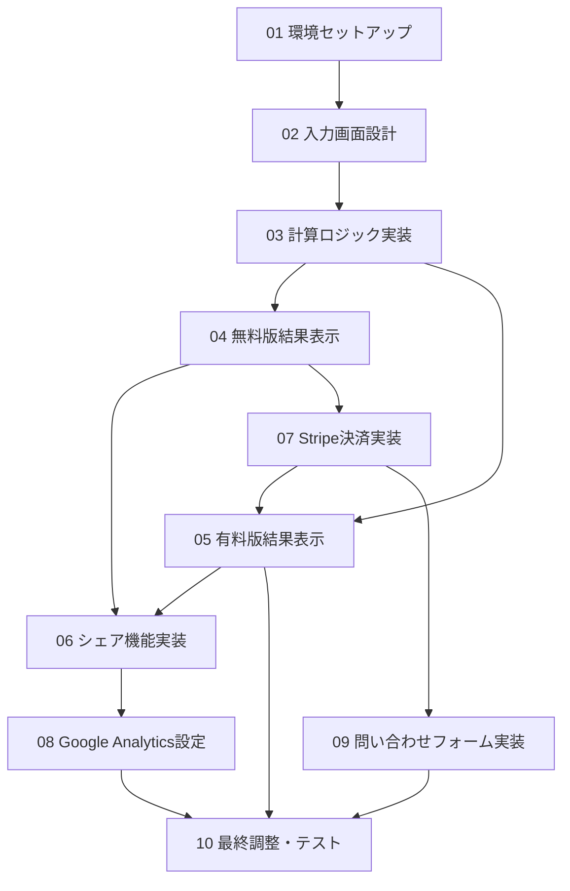

# MoneyCheck開発チケット管理

## 開発原則

### データベース・データ保存禁止
- **Supabase、PostgreSQL、MySQL等のデータベース使用禁止**
- **ユーザー入力データは一切保存しない**
- **セッション終了時にすべてのデータを完全削除**
- **プライバシー最優先：ユーザーデータ非保存を厳守**

## チケット一覧

| No | チケット名 | 優先度 | 状態 | Day |
|----|------------|--------|------|-----|
| 01 | [環境セットアップ](./01-環境セットアップ.md) | 🔴 High | ✅ Done | 1 |
| 02 | [入力画面設計](./02-入力画面設計.md) | 🔴 High | ✅ Done | 1 |
| 03 | [計算ロジック実装](./03-計算ロジック実装.md) | 🔴 High | ✅ Done | 1 |
| 04 | [無料版結果表示](./04-無料版結果表示.md) | 🔴 High | ✅ Done | 1 |
| 05 | [有料版結果表示](./05-有料版結果表示.md) | 🟡 Medium | ✅ Done | 2 |
| 06 | [シェア機能実装](./06-シェア機能実装.md) | 🟡 Medium | ✅ Done | 2 |
| 07 | [Stripe決済実装](./07-Stripe決済実装.md) | 🔴 High | ⏳ Ready | 2 |
| 08 | [Google Analytics設定](./08-Google Analytics設定.md) | 🟢 Low | ⏳ Ready | 2 |
| 09 | [問い合わせフォーム実装](./09-問い合わせフォーム実装.md) | 🟢 Low | ⏳ Ready | 2 |
| 10 | [最終調整・テスト](./10-最終調整・テスト.md) | 🔴 High | ⏳ Ready | 2 |

## 進捗管理

各チケット内のTodoリストで詳細な進捗を管理します。

### 状態の説明
- ⏳ Ready: 開始前
- 🚀 In Progress: 作業中
- ✅ Done: 完了
- ❌ Blocked: ブロック中

### チェックボックス管理方法
```markdown
- [ ] 未完了のタスク
- [x] 完了したタスク
```

## 開発スケジュール

### Day 1 (4チケット)
- 01 環境セットアップ
- 02 入力画面設計
- 03 計算ロジック実装
- 04 無料版結果表示

### Day 2 (6チケット)
- 05 有料版結果表示
- 06 シェア機能実装
- 07 Stripe決済実装
- 08 Google Analytics設定
- 09 問い合わせフォーム実装
- 10 最終調整・テスト

## 依存関係

